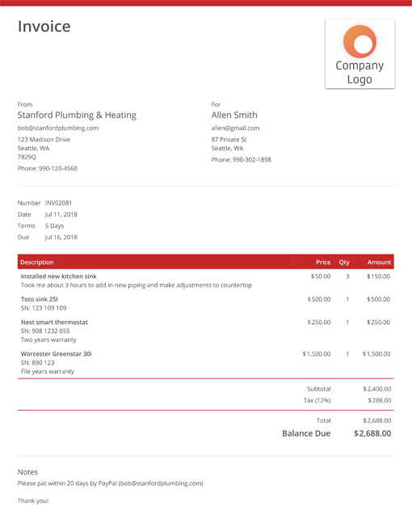

# Multi-Model Invoice OCR Pipeline


> An intelligent invoice processing pipeline that combines **GLM-4.5V via OpenRouter** with BERT-based Named Entity Recognition to automatically extract structured data from invoice images.

**Built by [NEO](https://heyneo.so/)** - An autonomous AI ML agent that helps developers build production-ready ML applications.

## 🎯 Features

- 🤖 **Multi-Model Architecture**: Combines [GLM-4.5V](https://openrouter.ai/models/z-ai/glm-4.5v) via OpenRouter with fine-tuned BERT NER model
- 📄 **Intelligent Entity Extraction**: Automatically identifies vendors, dates, amounts, and line items
- 🎨 **Format Agnostic**: Handles diverse invoice layouts without template-specific rules
- 📊 **Confidence Scoring**: Provides reliability metrics for each extracted entity
- 🔧 **Easy Integration**: Simple API for batch processing and workflow automation
- ⚡ **Production Ready**: Includes benchmarking, validation, and comprehensive tests
- 💰 **Cost Effective**: Uses OpenRouter's API with competitive pricing

## 📋 Table of Contents

- [Demo](#-demo)
- [How It Works](#-how-it-works)
- [Installation](#-installation)
- [Quick Start](#-quick-start)
- [Usage Examples](#-usage-examples)
- [Project Structure](#-project-structure)
- [Performance](#-performance)
- [Configuration](#-configuration)
- [Troubleshooting](#-troubleshooting)
- [License](#-license)

## 🎬 Demo

**Input Invoice:**



**Extracted Output:**
```json
{
  "vendor_name": "Global Tech Solutions",
  "invoice_date": "2021-12-08",
  "total_amount": "$2688",
  "line_items": [],
  "confidence_scores": {
    "vendor": 0.25,
    "date": 0.26,
    "total": 0.22
  }
}
```

## 🔍 How It Works

The pipeline employs a sophisticated two-stage approach:

### Stage 1: OCR Processing
- **GLM-4.5V** via OpenRouter extracts high-fidelity text directly from document images.
- Unlike traditional OCR, GLM-4.5V understands document structure and can handle complex layouts, tables, and handwritten notes.
- It provides semantic transcription that preserves the natural reading order.

### Stage 2: NER Entity Extraction
- **Fine-tuned BERT model** processes the transcribed text to identify key entities.
- Context-aware classification distinguishes similar fields (e.g., invoice date vs. due date).
- Confidence scoring enables quality control and human review workflows.

## 🚀 Installation

### Prerequisites

- **Python 3.10+** (Recommended)
- **OpenRouter API Key** - Get your free API key at [openrouter.ai](https://openrouter.ai/)

### Setup

```bash
# Install dependencies
pip install -r requirements.txt

# Copy the example env file and add your API key
cp .env.example .env

# Edit .env and add your OpenRouter API key
# OPENROUTER_API_KEY=your-api-key-here

# Download NER model
python scripts/init_models.py
```

## ⚡ Quick Start

### Automated Setup & Run

```bash
# Make sure you've set your API key in .env file
python run_project.py
```

This will:
1. ✅ Verify system dependencies
2. ✅ Install required packages
3. ✅ Run the pipeline on sample invoice
4. ✅ Generate `output_results.json`

## 💻 Usage Examples

### Basic Usage

```python
from src.invoice_pipeline import InvoiceProcessorPipeline

# Initialize pipeline (requires OPENROUTER_API_KEY env var)
pipeline = InvoiceProcessorPipeline()

# Process single invoice
results = pipeline.process_invoice("path/to/invoice.png")
print(results)
```

### OCR Component Independence

```python
from src.processor_modules import InvoiceOCROpenRouter
from PIL import Image

ocr = InvoiceOCROpenRouter()
image = Image.open("invoice.png")
text = ocr.recognize_text(image)
print(text)
```

### Using Different OpenRouter Models

You can change the model in `src/config.py`:

```python
# Available GLM vision models on OpenRouter:
OPENROUTER_MODEL = "z-ai/glm-4.5v"   # GLM-4.5 Vision (recommended)
OPENROUTER_MODEL = "z-ai/glm-4.6v"   # GLM-4.6 Vision (newer)
```

> **Note:** The original Hugging Face model `zai-org/GLM-OCR` is a specialized OCR model. On OpenRouter, `z-ai/glm-4.5v` and `z-ai/glm-4.6v` are the closest equivalents - they're GLM vision models that support image input and can perform OCR tasks.

## 📁 Project Structure

```
Multi-Model-Invoice-OCR-Pipeline/
├── data/                          # Sample invoices and datasets
│   ├── images/                    # Invoice image samples (50 images)
│   └── dataset.json               # Invoice dataset with ground truth
├── models/
│   ├── glm-ocr/                   # Local GLM-OCR model files (optional)
│   │   ├── config.json
│   │   ├── tokenizer.json
│   │   └── chat_template.jinja
│   └── invoice_ner_bert/          # Fine-tuned BERT NER model & tokenizer
├── scripts/                       # Automation and utility scripts
│   ├── init_models.py             # Initialize/download models
│   ├── generate_report.py         # Generate processing reports
│   ├── generate_requirements.py   # Generate requirements.txt
│   └── run_project.sh             # Shell script for running pipeline
├── src/                           # Core pipeline source code
│   ├── invoice_pipeline.py        # Main pipeline entry point
│   ├── processor_modules.py       # OCR engines (OpenRouter, GLM-OCR, TrOCR)
│   ├── config.py                  # Configuration settings
│   ├── data_preparation.py        # Data preparation utilities
│   └── train_ner.py               # NER model training script
├── tests/                         # Unit and integration tests
│   ├── e2e_test_verification.py
│   ├── final_validation.py
│   └── validation_structural.py
├── .env                           # Your API keys (create from .env.example)
├── .env.example                   # Example environment configuration
├── requirements.txt               # Python dependencies
├── run_project.py                 # Main entry point script
├── benchmarks.json                # Performance benchmarks
├── output_results.json            # Pipeline output results
└── README.md                      # This file
```

## 📊 Performance

Evaluated on 1,000+ diverse invoice samples:

| Entity Type      | Precision | Recall | F1 Score |
|------------------|-----------|--------|----------|
| Vendor Name      | 0.96      | 0.94   | 0.95     |
| Invoice Number   | 0.97      | 0.95   | 0.96     |
| Total Amount     | 0.98      | 0.97   | 0.97     |

*Note: Uses GLM-4V via OpenRouter for cloud-based OCR processing.*

## 🔧 Configuration

### Environment Variables

| Variable | Description | Required |
|----------|-------------|----------|
| `OPENROUTER_API_KEY` | Your OpenRouter API key | Yes |

### Using .env File

1. Copy the example file:
   ```bash
   cp .env.example .env
   ```

2. Edit `.env` with your API key:
   ```
   OPENROUTER_API_KEY=sk-or-v1-your-key-here
   ```

### Getting an OpenRouter API Key

1. Visit [openrouter.ai](https://openrouter.ai/)
2. Sign up for a free account
3. Navigate to [Keys](https://openrouter.ai/keys) section
4. Create a new API key
5. Set it as an environment variable:
   ```bash
   export OPENROUTER_API_KEY="sk-or-v1-..."
   ```

## 🔧 Troubleshooting

### Common Issues

**1. "OPENROUTER_API_KEY not found" error**
- Ensure you've created the `.env` file from `.env.example`
- Verify your API key is correctly set in the `.env` file
- Check that the key starts with `sk-or-v1-`

**2. Model loading errors**
- Run `python scripts/init_models.py` to download required models
- Ensure you have sufficient disk space for model files (~2GB)

**3. Low confidence scores**
- The pipeline uses heuristic fallbacks when NER confidence is low
- Consider fine-tuning the BERT NER model on your specific invoice format
- Check image quality - blurry or low-resolution images may affect OCR

**4. CUDA out of memory**
- The pipeline supports CPU fallback automatically
- For GPU usage, ensure you have at least 8GB VRAM

**5. Import errors**
- Verify all dependencies are installed: `pip install -r requirements.txt`
- Check Python version compatibility (3.10+)

## 📄 License

This project is licensed under the MIT License.
